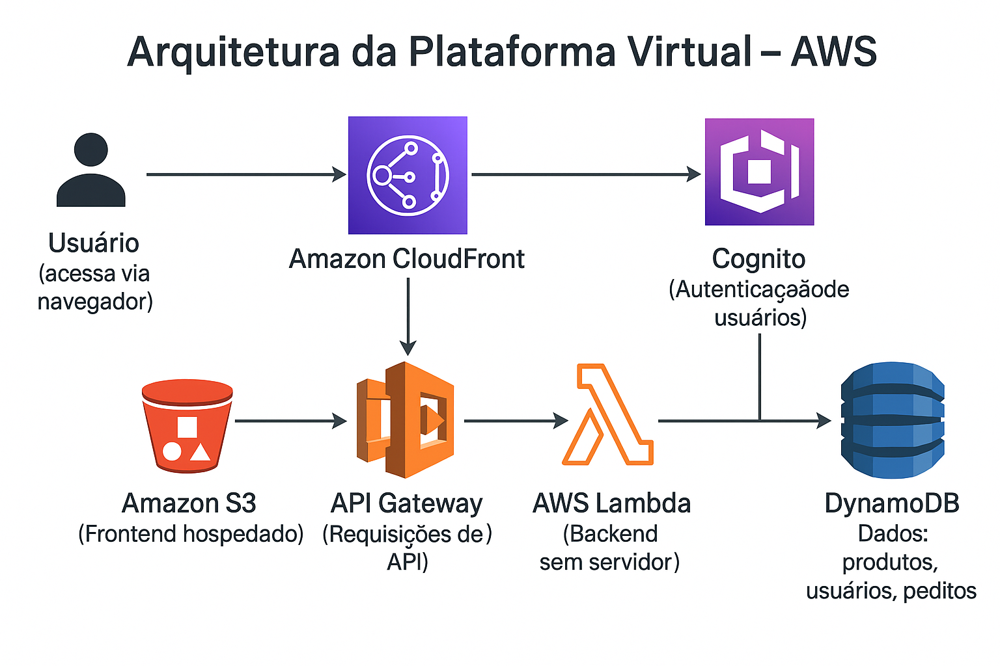

# 💊 Plataforma Virtual para Farmácia - AWS | Abstergo Industries

Este projeto consiste no desenvolvimento de uma plataforma virtual para uma farmácia fictícia, utilizando serviços da AWS com arquitetura serverless.

📅 **Data de início:** 24/07/2025  
👩‍💻 **Responsável:** Adriana Abreu de Almeida  
🛠️ **Cargo:** Analista de Desenvolvimento Júnior  

---

## 🚀 Tecnologias e Serviços AWS Utilizados

- Amazon S3 + CloudFront – Hospedagem do frontend
- AWS Lambda – Backend serverless
- Amazon API Gateway – Gerenciamento das APIs
- Amazon DynamoDB – Banco de dados NoSQL
- Amazon Cognito – Autenticação de usuários

---

## 📊 Relatórios

📝 [Relatório de Implementação](docs/relatorio-implementacao.md)  
📈 [Desempenho das Funções](docs/desempenho.md)  
📜 [Documentação Técnica](docs/documentacao-tecnica.md)  
💰 [Análise de Custos](docs/analise-custos.md)

---

## 📷 Arquitetura da Solução

---

## 📁 Organização do Projeto

- `src/` – Códigos das funções Lambda (exemplos)
- `docs/` – Relatórios e documentação técnica
- `imagens/` – Diagramas e ilustrações da arquitetura

---

## ✅ Conclusão

O projeto demonstrou como utilizar a AWS para criar soluções escaláveis, econômicas e seguras. A infraestrutura serverless permitiu ganhos significativos de desempenho e redução de custos.

---
